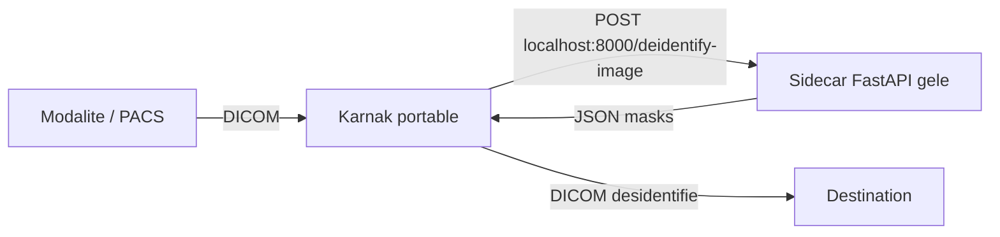

# Guide : intégrer l'API de désidentification dans Karnak portable

Objectif : embarquer ce service FastAPI dans le paquet **portable** de Karnak
(branche `feat/add-automatic-desidentification`), **sans que l'utilisateur final
installe Python ni quoi que ce soit**, et en **minimisant l'espace disque**.

---

## Résumé exécutif (la solution recommandée)

1. Le service tourne comme **processus annexe (sidecar)** à côté de Karnak, sur
   `http://localhost:8000`. Karnak l'appelle déjà à cette URL.
2. On le transforme en **exécutable autonome** avec **PyInstaller (mode `--onedir`)**.
   L'exécutable embarque l'interpréteur Python + les dépendances : l'utilisateur
   n'a rien à installer.
3. **Le levier d'espace #1** : remplacer `paddlepaddle` (plusieurs centaines de Mo)
   par **`onnxruntime`** via les modèles OCR convertis en ONNX. On passe d'un
   bundle d'environ **0,7 à 1,4 Go** à environ **120 à 250 Mo** par OS.
4. On lance/arrête le sidecar depuis les scripts `run.sh` / `run.bat` du paquet
   portable, et on construit le bundle dans la CI, sur le même runner que Karnak.

Deux variantes sont décrites :

| Variante | OCR | Changement de code | Taille (ordre de grandeur, par OS) |
|----------|-----|--------------------|------------------------------------|
| **A (recommandée)** | onnxruntime (modèles ONNX) | Oui, contenu à `image_processing.py` | ~120-250 Mo |
| **B (repli)** | paddlepaddle tel quel | Aucun | ~700 Mo-1,4 Go |

> La variante A est celle qui satisfait **toutes** les conditions (autonome +
> minimal). La variante B existe si vous refusez tout changement de code.

---

## 0. Le contrat d'intégration (ce que Karnak attend déjà)

Vérifié dans la branche `feat/add-automatic-desidentification` :

- `src/main/resources/application.yml` :
  ```yaml
  karnak:
    deidentify-image:
      url: ${DEIDENTIFY_IMAGE_URL:http://localhost:8000}
  ```
- `DeidentifyImageService.java` construit un `RestClient` sur cette `baseUrl` et
  fait un `POST /deidentify-image` (multipart). En cas d'API injoignable, il
  **catch `ResourceAccessException`** et renvoie une liste de masques vide : si le
  sidecar n'est pas lancé, Karnak continue mais **n'applique aucun masque image**.
- Le profil `portable` (`application-portable.yml`) **ne surcharge pas** cette URL.
  Donc en portable, l'API doit écouter sur `localhost:8000` (ou bien on définit
  `DEIDENTIFY_IMAGE_URL`).

Conséquences pour le portable :

- Le service Python **doit** écouter sur `127.0.0.1:8000`.
- Le service **doit** être démarré avant/avec Karnak et arrêté avec lui.
- Comme Karnak tolère l'absence du service, on peut le rendre **activable/désactivable**
  par un flag de configuration sans casser Karnak.



---

## 1. Architecture retenue

```
karnak-<os>-jdk25-<version>/        <- dossier portable genere par jpackage
  Karnak/ (ou Karnak.app/)          <- Karnak + JRE embarquee
  run.cfg
  run.sh / run.bat
  deidentification/                 <- AJOUT : bundle PyInstaller (onedir)
    deidentify-karnak (ou .exe)     <- executable autonome
    _internal/                      <- interpreteur Python + libs + modeles OCR
```

Le bundle est **autonome** : interpréteur Python, dépendances et modèles OCR sont
dans `deidentification/`. Aucune installation côté utilisateur.

---

## 2. La décision clé pour l'espace : sortir `paddlepaddle`

`paddlepaddle` est de loin le plus gros poste (le moteur de deep learning, MKL/oneDNN,
etc.). Les modèles OCR eux-mêmes sont déjà **mobiles** et minuscules
(`PP-OCRv5_mobile_det`, `latin_PP-OCRv5_mobile_rec`, quelques Mo chacun).

| Composant | Taille installée (ordre de grandeur) |
|-----------|--------------------------------------|
| `paddlepaddle` (CPU) | ~400 Mo - 1 Go |
| `onnxruntime` | ~15 - 60 Mo |
| `opencv-python` | ~60 - 90 Mo |
| `opencv-python-headless` (remplacement) | ~40 - 60 Mo, sans libs GUI |
| Interpréteur Python + stdlib (via PyInstaller) | ~30 - 60 Mo |
| Modèles OCR det + rec (mobile) | quelques Mo |

Donc : **remplacer `paddlepaddle` par `onnxruntime`** est ce qui fait passer le
bundle de ~1 Go à ~150 Mo. Les modèles PaddleOCR s'exécutent en ONNX via
`onnxruntime` sans perte fonctionnelle notable (à valider via les tests golden).

---

## 3. Préparer l'application pour le gel (commun aux 2 variantes)

### 3.1 Un lanceur dédié « portable »

Créez `server_portable.py` à la racine du dépôt. Il fige les réglages portables
(processus unique, modèles embarqués, caches dans un dossier temporaire) **avant**
d'importer l'app.

```python
# server_portable.py
import multiprocessing
import os
import sys
import tempfile


def _setup_env() -> None:
    # Modèles embarqués dans le bundle (voir le .spec). En onedir, _MEIPASS
    # pointe vers le dossier _internal/.
    if getattr(sys, "frozen", False):
        base = sys._MEIPASS
        os.environ.setdefault("MODEL_DATA_PATH", os.path.join(base, "data"))

    # Portable : un seul worker, pas de multiprocessing fragile sous gel.
    os.environ.setdefault("WORKERS", "1")

    # Empêcher tout téléchargement / écriture en zone non inscriptible :
    # on confine les caches éventuels dans un dossier temporaire inscriptible.
    cache_dir = os.path.join(tempfile.gettempdir(), "deidentify-karnak-cache")
    os.makedirs(cache_dir, exist_ok=True)
    os.environ.setdefault("PADDLE_PDX_CACHE_HOME", cache_dir)
    os.environ.setdefault("PADDLEX_HOME", cache_dir)
    os.environ.setdefault("HF_HOME", cache_dir)


def main() -> None:
    multiprocessing.freeze_support()  # indispensable si un worker est spawn
    _setup_env()
    import uvicorn

    uvicorn.run(
        "image_ocr_identifier.main:app",
        host=os.environ.get("HOST", "127.0.0.1"),  # local uniquement
        port=int(os.environ.get("PORT", "8000")),
        workers=1,
        h11_max_incomplete_event_size=50 * 1024 * 1024,
    )


if __name__ == "__main__":
    main()
```

Notes :

- On écoute sur **127.0.0.1** (et non `0.0.0.0`) : le service n'est joignable
  que localement, ce que Karnak attend, et ça évite d'exposer le port.
- `MODEL_DATA_PATH` est défini explicitement : en gelé, le chemin par défaut
  `Path(__file__).parent.parent.parent / "data"` de `image_processing.py` n'est
  plus valable.
- `workers=1` évite les pièges du multiprocessing sous PyInstaller. Le sidecar
  est un service long, un worker suffit largement.

### 3.2 Modèles à embarquer

Seuls **deux** modèles sont utilisés par défaut (voir `image_processing.py`) :

- `data/models/detection/PP-OCRv5_mobile_det`
- `data/models/recognition/latin_PP-OCRv5_mobile_rec`

Les autres dossiers (`PP-OCRv5_server_det`, `en_PP-OCRv3_det`,
`latin_PP-OCRv3_mobile_rec`, `ch_ppocr_mobile_v2.0_cls_infer`) **ne sont pas
nécessaires** (l'orientation de ligne est désactivée) : ne les embarquez pas.
`data/liste_titre.txt` n'est pas lu par le service (données d'exemple) : à ne pas
embarquer non plus.

---

## 4. Variante A (recommandée) : migrer l'OCR vers `onnxruntime`

But : que `image_processing.py` n'importe plus `paddleocr`/`paddlepaddle`, mais
exécute les mêmes modèles en ONNX. Deux options :

### Option 4.1 — RapidOCR (le plus simple)

`rapidocr-onnxruntime` est PaddleOCR porté sur `onnxruntime`. On lui fournit les
modèles ONNX (voir conversion ci-dessous) et on adapte la fonction de sortie.

Dépendances (remplacent `paddleocr` + `paddlepaddle`) :

```toml
# pyproject.toml (extrait, variante A)
dependencies = [
    "opencv-python-headless (>=4.13.0.92,<5.0.0.0)",   # headless => plus léger
    "pydicom (>=3.0.2,<4.0.0)",
    "python-gdcm (>=3.2.2,<4.0.0)",
    "onnxruntime (>=1.18,<2.0)",
    "rapidocr-onnxruntime (>=1.4,<2.0)",
    "python-dotenv (>=1.2.2,<2.0.0)",
    "pip-system-certs (>=5.3,<6.0)",
    "fastapi[standard] (>=0.135.3,<0.136.0)",
    "rapidfuzz (>=3.14.5,<4.0.0)",
]
```

Adapter UNIQUEMENT le point d'entrée OCR de `image_processing.py`. Le reste du
pipeline (`split_ocr_blocks`, détection sensible, couleurs) reste inchangé tant
que vous reproduisez **le même format** `{"texts": [...], "boxes": [...]}` :

```python
# image_processing.py (variante A, schéma)
import os
from pathlib import Path
import numpy as np
from rapidocr_onnxruntime import RapidOCR
from image_ocr_identifier.debug import DebugSession, save_debug_ocr

_BASE = Path(os.environ.get("MODEL_DATA_PATH",
             str(Path(__file__).parent.parent.parent / "data")))

_det = str(_BASE / "models" / "onnx" / "det.onnx")
_rec = str(_BASE / "models" / "onnx" / "rec.onnx")

_ocr = RapidOCR(det_model_path=_det, rec_model_path=_rec, use_cls=False)


def process_image_with_ocr(image: np.ndarray,
                           debug_session: DebugSession | None = None) -> dict[str, list]:
    result, _ = _ocr(image)            # result = [[box(4 points), text, score], ...]
    save_debug_ocr(result, debug_session)
    if not result:
        return {"texts": [], "boxes": []}
    texts = [item[1] for item in result]
    # IMPORTANT : convertir les polygones 4 points au MÊME format de box que
    # celui attendu par split_ocr_blocks / color_detection (rec_boxes Paddle).
    boxes = [_poly_to_box(item[0]) for item in result]
    return {"texts": texts, "boxes": boxes}
```

À faire impérativement :

1. **Aligner le format des boîtes** : PaddleOCR renvoyait `rec_boxes` ; RapidOCR
   renvoie des polygones 4 points. Implémentez `_poly_to_box(...)` pour produire
   exactement la structure consommée en aval (`_split_single_block`,
   `color_detection`). Vérifiez aussi `save_debug_ocr` dans `debug.py`.
2. **Revalider** avec la suite golden d'intégration :
   ```bash
   DEIDENT_REAL_OCR=1 pytest -m integration
   # si écart attendu et validé visuellement :
   DEIDENT_REAL_OCR=1 pytest -m integration --update-golden
   ```

### Option 4.2 — Convertir les modèles Paddle en ONNX

Une seule fois, sur une machine de dev (avec Python) :

```bash
pip install paddle2onnx
# Détection
paddle2onnx \
  --model_dir data/models/detection/PP-OCRv5_mobile_det \
  --model_filename inference.json \
  --params_filename inference.pdiparams \
  --save_file data/models/onnx/det.onnx --opset_version 14
# Reconnaissance
paddle2onnx \
  --model_dir data/models/recognition/latin_PP-OCRv5_mobile_rec \
  --model_filename inference.json \
  --params_filename inference.pdiparams \
  --save_file data/models/onnx/rec.onnx --opset_version 14
```

> Vérifiez les noms réels des fichiers d'inférence dans chaque dossier modèle
> (`inference.json/.pdmodel` + `inference.pdiparams`) avant de lancer la commande.

Les `.onnx` produits (quelques Mo) sont les seuls modèles à embarquer.

---

## 5. Construire le bundle autonome (PyInstaller, `--onedir`)

> L'environnement de **build** (dev ou CI) a Python ; **l'utilisateur final non**.
> PyInstaller ne fait **pas** de cross-compilation : il faut construire sur
> **chaque OS cible** (macOS, Windows, Linux). Cela tombe bien : la CI Karnak a
> déjà une matrice sur ces trois OS.

### 5.1 Fichier `.spec` (variante A, ONNX)

```python
# deidentify-karnak.spec
from PyInstaller.utils.hooks import collect_all, collect_submodules

datas = []
binaries = []
hiddenimports = [
    "uvicorn.lifespan.on",
    "uvicorn.loops.auto",
    "uvicorn.protocols.http.auto",
    "uvicorn.protocols.websockets.auto",
]
hiddenimports += collect_submodules("uvicorn")

for pkg in ("rapidocr_onnxruntime", "onnxruntime"):
    d, b, h = collect_all(pkg)
    datas += d
    binaries += b
    hiddenimports += h

# Modèles ONNX uniquement (quelques Mo)
datas += [
    ("data/models/onnx/det.onnx", "data/models/onnx"),
    ("data/models/onnx/rec.onnx", "data/models/onnx"),
]

a = Analysis(
    ["server_portable.py"],
    pathex=["src"],
    binaries=binaries,
    datas=datas,
    hiddenimports=hiddenimports,
    excludes=[
        "tkinter", "matplotlib", "pytest", "IPython", "notebook",
        "PyQt5", "PySide2", "PIL.ImageQt",
    ],
    noarchive=False,
)
pyz = PYZ(a.pure)
exe = EXE(
    pyz, a.scripts, [],
    exclude_binaries=True,
    name="deidentify-karnak",
    console=True,
    strip=True,   # Linux/macOS : retire les symboles
    upx=True,     # nécessite UPX installé
)
coll = COLLECT(
    exe, a.binaries, a.datas,
    strip=True,
    upx=True,
    upx_exclude=[],
    name="deidentify-karnak",
)
```

Construction :

```bash
pip install pyinstaller
pyinstaller --noconfirm deidentify-karnak.spec
# Résultat : dist/deidentify-karnak/  (dossier onedir autonome)
```

### 5.2 Variante B (paddle tel quel)

Si vous gardez `paddleocr` + `paddlepaddle`, remplacez la boucle `for pkg in (...)`
par :

```python
for pkg in ("paddle", "paddleocr", "paddlex"):
    d, b, h = collect_all(pkg)
    datas += d; binaries += b; hiddenimports += h
```

et embarquez les deux dossiers de modèles Paddle (det + rec) au lieu des `.onnx` :

```python
datas += [
    ("data/models/detection/PP-OCRv5_mobile_det",
     "data/models/detection/PP-OCRv5_mobile_det"),
    ("data/models/recognition/latin_PP-OCRv5_mobile_rec",
     "data/models/recognition/latin_PP-OCRv5_mobile_rec"),
]
```

Attendez-vous à un bundle bien plus gros et à plus de réglages (hooks Paddle).

---

## 6. Réduction de la taille : checklist

- [ ] **`onnxruntime` au lieu de `paddlepaddle`** (gain principal, variante A).
- [ ] **`opencv-python-headless`** au lieu de `opencv-python`.
- [ ] N'embarquer **que les 2 modèles utilisés** (det + rec). Supprimer les
      modèles serveur / v3 / cls inutilisés.
- [ ] `--onedir` (pas `--onefile`) : démarrage plus rapide, et le dossier se
      **compresse mieux** dans le zip final du paquet.
- [ ] `strip=True` + **UPX** (`upx=True`).
- [ ] `excludes` : `tkinter`, `matplotlib`, `pytest`, Qt, etc.
- [ ] Après build, supprimer les résidus : `__pycache__`, en-têtes `*.h`,
      bibliothèques statiques `*.a`/`*.lib`, et tout pack **CUDA/nvidia** si une
      dépendance en tire (inutile en CPU).
- [ ] Laisser la **compression du zip à la fin** (la CI Karnak utilise déjà
      `compression-level: '9'`).

---

## 7. Intégration dans le build portable de Karnak

Trois points de greffe dans la branche `feat/add-automatic-desidentification`.

### 7.1 `run.cfg` — exposer un flag

Ajoutez à `build-portable/run.cfg` :

```ini
#  --------------------------------------------------------
#  Desidentification d'image (OCR sur pixels)
#  --------------------------------------------------------
DEIDENTIFY_IMAGE_ENABLED=true
DEIDENTIFY_IMAGE_URL=http://localhost:8000
```

### 7.2 `run.sh` — démarrer/arrêter le sidecar

Dans `build-portable/run.sh`, ajoutez une fonction de démarrage, appelez-la après
le chargement de la config, et arrêtez le processus dans `cleanup`.

Fonction (à placer près de `generate_db_password`) :

```bash
start_deidentify() {
  if [[ "${DEIDENTIFY_IMAGE_ENABLED:-true}" != "true" ]]; then
    log "De-identification image service disabled (DEIDENTIFY_IMAGE_ENABLED)"
    return
  fi
  local bin="$APP_DIR/deidentification/deidentify-karnak"
  if [[ ! -x "$bin" ]]; then
    log "De-identification binary not found at '$bin' — skipping"
    return
  fi
  log "Starting de-identification image service..."
  "$bin" &
  DEIDENT_PID=$!
}
```

Appel (après le bloc qui source `run.cfg`, avant de lancer Karnak) :

```bash
start_deidentify
```

Dans `cleanup()`, avant l'arrêt de Karnak, ajoutez :

```bash
  # Stop the de-identification sidecar if running
  if [[ -n "${DEIDENT_PID:-}" ]] && kill -0 "$DEIDENT_PID" 2>/dev/null; then
    log "Stopping de-identification service (PID: $DEIDENT_PID)"
    kill -TERM "$DEIDENT_PID" 2>/dev/null || true
    wait "$DEIDENT_PID" 2>/dev/null || true
  fi
```

Le `trap cleanup EXIT INT TERM` déjà présent garantit l'arrêt du sidecar quand
Karnak s'arrête.

### 7.3 `run.bat` — équivalent Windows

Dans `build-portable/run.bat`, avant `start "Karnak" "%KARNAK_BIN%"` :

```bat
rem Start de-identification image service (optional)
if /i "%DEIDENTIFY_IMAGE_ENABLED%"=="true" (
  if exist "%APP_DIR%deidentification\deidentify-karnak.exe" (
    echo [run.bat] Starting de-identification image service...
    start "Deidentify" /min "%APP_DIR%deidentification\deidentify-karnak.exe"
  )
)
```

> `run.bat` lance Karnak puis rend la main (pas de `wait`/cleanup comme `run.sh`).
> Le sidecar vit donc tant que sa fenêtre est ouverte ; à la fermeture de Karnak,
> fermez aussi la fenêtre « Deidentify » (ou ajoutez un `taskkill` dans votre
> procédure d'arrêt). Pour un arrêt couplé plus strict, transformez `run.bat` en
> script qui attend Karnak puis fait `taskkill /IM deidentify-karnak.exe /F`.

### 7.4 CI — construire le bundle sur chaque runner

Dans `.github/workflows/build-installer.yml`, la matrice tourne déjà sur
`macos-latest`, `windows-latest`, `ubuntu-latest`. Ajoutez, **après** l'étape
« Build with Maven » et **avant** l'upload de l'artefact, des étapes qui :

1. installent Python sur le runner (`actions/setup-python`),
2. installent les deps + PyInstaller,
3. construisent le `.spec`,
4. copient `dist/deidentify-karnak/` dans `target/${APP_PACKAGE_FOLDER}/deidentification/`.

Exemple (à adapter ; ce dépôt-ci est celui de l'API, à cloner/poser à côté) :

```yaml
      - name: Set up Python
        uses: actions/setup-python@v5
        with:
          python-version: '3.12'

      - name: Build de-identification sidecar
        shell: bash
        run: |
          python -m pip install --upgrade pip pyinstaller
          python -m pip install .                 # installe l'API + deps
          pyinstaller --noconfirm deidentify-karnak.spec
          dest="target/${APP_PACKAGE_FOLDER}/deidentification"
          mkdir -p "$dest"
          cp -r dist/deidentify-karnak/* "$dest/"
```

L'upload existant (`path: target/${APP_PACKAGE_FOLDER}`) embarquera alors
automatiquement le dossier `deidentification/`.

> Alternative sans CL : copier le bundle dans `package.sh` juste après les
> `cp "$curPath/run.cfg" "$OUTPUT_PATH/"`. Mais `package.sh` ne sait pas
> construire le bundle Python ; il faut donc qu'il existe déjà. L'option CI
> ci-dessus est plus simple et garantit que le bundle est construit sur le bon OS.

---

## 8. Validation

Sur la machine de build, dossier portable généré :

```bash
# 1) Le sidecar démarre seul et répond
./deidentification/deidentify-karnak &
curl -s http://localhost:8000/health         # -> {"status":"ok"}

# 2) Karnak + sidecar via le script portable
./run.sh
# Dans les logs Karnak : aucune trace de "Cannot reach de-identification image API"
# quand le service tourne ; sinon vérifier le port 8000 et le flag.
```

Test fonctionnel : envoyez une étude DICOM avec du texte « brûlé » dans les
pixels, vérifiez que Karnak applique bien les masques renvoyés par l'API.

Checklist :

- [ ] `GET /health` répond `{"status":"ok"}`.
- [ ] L'exécutable tourne sur une machine **sans Python**.
- [ ] Les modèles se chargent (pas d'erreur `OCR ... model directory not found`).
- [ ] Aucun accès réseau sortant au démarrage (modèles embarqués, source check
      désactivé).
- [ ] Arrêt de Karnak => arrêt du sidecar (Linux/macOS via `cleanup`).

---

## 9. Récapitulatif et pièges

Tailles indicatives finales du dossier `deidentification/` (par OS) :

| Variante | Avant zip | Remarque |
|----------|-----------|----------|
| A (onnxruntime) | ~120 - 250 Mo | recommandé, satisfait toutes les conditions |
| B (paddlepaddle) | ~700 Mo - 1,4 Go | zéro changement de code |

Pièges fréquents :

- **Cross-compilation** : impossible avec PyInstaller. Construire sur chaque OS.
- **Modèles introuvables en gelé** : toujours définir `MODEL_DATA_PATH` (fait dans
  `server_portable.py`).
- **uvicorn multi-workers** sous gel : garder `workers=1` + `freeze_support()`.
- **`opencv-python` (non headless)** tire des libs GUI inutiles : préférer
  `opencv-python-headless`.
- **Format des boîtes OCR** (variante A) : c'est le seul vrai risque fonctionnel.
  Faites correspondre la sortie de RapidOCR au format attendu et **revalidez les
  golden tests** avant de livrer.
- **Sécurité** : écouter sur `127.0.0.1` uniquement ; ne pas exposer le port 8000.
```
